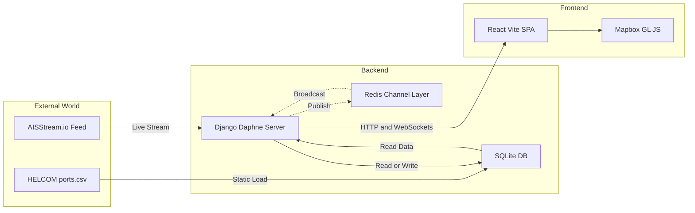
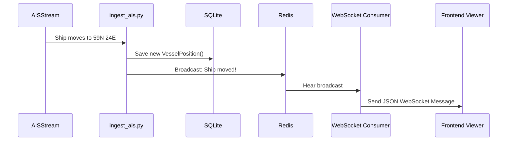

# Boating in the Baltics: System Architecture

This document provides a detailed, step-by-step breakdown of how data flows from the external world, through the database, into the backend, and finally onto the user's screen in the frontend.

---

## 🚀 The Big Picture

The "Boating in the Baltics" application is built on a decoupled architecture. This means the Frontend (React UI) and the Backend (Django Server) are completely separate entities that talk to each other over the internet.

---

## 🗄️ 1. The Database Storage layer

At the absolute foundation is the **Database**. Currently, you are using a local `db.sqlite3` file.

The database is rigidly structured using Data "Models" defined in Django:

- **Vessel**: A specific ship (MMSI, Name).
- **VesselPosition**: A breadcrumb representing exactly where that vessel was at a specific second (Latitude, Longitude, Heading).
- **Port**: A static port location in the Baltic Sea.
- **Zone / Alert**: User-drawn polygons and the alerts generated when ships cross into them.

**Important Note on Render:** Because Render Free Web Services use ephemeral memory, this SQLite database is wiped clean every time you push new code to GitHub and Render redeploys.

---

## ⚙️ 2. The Backend Server (Django on Render)

The backend has two completely different, simultaneous jobs: **Ingesting Data** and **Serving the Frontend**.

### Job A: Ingesting Data (The Background Workers)

While the server is running, it runs two infinite loops in the background that constantly feed the database:

1.  **`ingest_helcom.py`**: When the server first boots up, this script reads the provided `ports.csv` file, groups raw port coordinates together, calculates their exact center (centroid), deletes the old database entries, and saves the 28 clean Baltic ports into the SQLite Database.
2.  **`ingest_ais.py`**: A relentless listener. It opens a persistant WebSocket out to the external `AISStream.io` service. Every time a ship moves in the Baltic Sea, AISStream sends a message. The script catches it, saves the new `VesselPosition` into the SQLite database, checks if the ship just entered a user's `Zone`, and mathematically prepares the data.

### Job B: Serving the Frontend (Daphne & Redis)

Once data is in the database, the frontend needs to retrieve it. Django does this in two ways:

1.  **REST API (HTTP):** When the frontend first loads, it asks Django "Give me all the ports, zones, and current vessels." Django uses "Serializers" to turn the Python Database Models into raw JSON text, and sends it back in a standard HTTP Response.
2.  **WebSockets (Real-time updates via Channels & Redis):** Standard HTTP is slow because the frontend has to constantly ask "Any updates?". Instead, the frontend opens a permanent WebSocket connection to Django (`/ws/vessels/`).
    - **The Redis Magic:** When `ingest_ais.py` catches a new ship movement, it doesn't just save it to the DB. It shouts that movement into a **Redis** "Channel Layer" (like a megaphone).
    - The `consumers.py` script hears the megaphone and instantly shoves the new ship coordinate down the open WebSocket directly to the user's browser, bypassing the database entirely for maximum speed.

---

## 💻 3. The Frontend Client (React on Vercel)

The frontend is a static bundle of JavaScript and CSS hosted on Vercel. Vercel simply gives the user the raw code, and the user's own web browser executes it.

### The Application State (`App.jsx`)

When the user visits the site, the React App boots up:

1.  It uses `api.js` to send standard HTTP requests to the Render backend to get the baseline data (the 28 Ports, user Zones, etc.).
2.  It uses `useWebSocket.js` to open a permanent tunnel to the Render backend, waiting for live ship movements to be streamed in.

### The Render Loop

When new data arrives (either from the initial load or a WebSocket update):

1.  React updates its internal "State" (memory).
2.  React passes this state down into its components: `Sidebar`, `PortDetailPanel`, and `MapView`.
3.  **MapView** is the heaviest component. It takes the array of JSON ship coordinates and hands them off to the **Mapbox GL JS** engine. Mapbox takes those raw numbers and physically draws the white Port anchors, the colored ship directional arrows, and the drawn polygon zones onto the WebGL globe on your screen.

If the WebSocket receives a message that a ship moved:

1. React instantly updates the ship's coordinate in memory.
2. Mapbox immediately redraws the specific ship arrow at the new location, creating the illusion of smooth, real-time animation.
